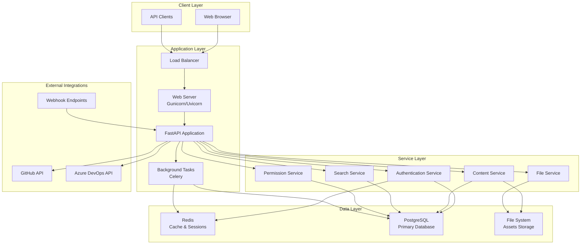

# Design Document

## Overview

This design outlines a high-performance Python-based wiki/documentation application with PostgreSQL backend, server-side rendering, and advanced search capabilities. The system prioritizes search performance while providing comprehensive content management, security, and developer-focused features.

## Architecture

### High-Level Architecture



### Technology Stack

- **Backend Framework**: FastAPI (for high performance, automatic OpenAPI generation, and async support)
- **Database**: PostgreSQL 15+ with full-text search and JSON support
- **Caching**: Redis for session management, search caching, and rate limiting
- **Task Queue**: Celery with Redis broker for background tasks
- **Web Server**: Gunicorn with Uvicorn workers for production
- **Template Engine**: Jinja2 for server-side rendering
- **Authentication**: JWT bearer tokens with Redis-based session management
- **File Storage**: Local filesystem with configurable storage backends
- **Search**: PostgreSQL full-text search with GIN indexes and autocomplete

## Components and Interfaces

### Core Services

#### 1. Authentication Service
```python
class AuthenticationService:
    async def authenticate_token(self, token: str) -> User
    async def validate_permissions(self, user: User, resource: str, action: str) -> bool
    async def create_session(self, user: User) -> Session
    async def invalidate_session(self, session_id: str) -> None
    async def check_rate_limit(self, user_id: str, action: str) -> bool
```

#### 2. Content Service
```python
class ContentService:
    async def create_document(self, doc: DocumentCreate, user: User) -> Document
    async def update_document(self, doc_id: str, updates: DocumentUpdate, user: User) -> Document
    async def get_document(self, doc_id: str, user: User) -> Document
    async def delete_document(self, doc_id: str, user: User) -> None
    async def create_revision(self, doc_id: str, content: str, user: User) -> Revision
    async def get_revisions(self, doc_id: str, user: User) -> List[Revision]
    async def move_document(self, doc_id: str, new_path: str, user: User) -> Document
```

#### 3. Search Service
```python
class SearchService:
    async def search_documents(self, query: str, filters: SearchFilters, user: User) -> SearchResults
    async def autocomplete_tags(self, partial: str, user: User) -> List[str]
    async def get_search_suggestions(self, query: str, user: User) -> List[str]
    async def index_document(self, document: Document) -> None
    async def remove_from_index(self, doc_id: str) -> None
```

#### 4. Permission Service
```python
class PermissionService:
    async def check_permission(self, user: User, resource: str, action: str) -> bool
    async def get_user_permissions(self, user: User) -> List[Permission]
    async def create_permission_group(self, group: PermissionGroupCreate) -> PermissionGroup
    async def assign_user_to_group(self, user_id: str, group_id: str) -> None
    async def evaluate_path_patterns(self, user: User, path: str) -> List[Permission]
```

#### 5. File Service
```python
class FileService:
    async def upload_file(self, file: UploadFile, path: str, user: User) -> FileMetadata
    async def get_file(self, file_path: str, user: User) -> FileResponse
    async def delete_file(self, file_path: str, user: User) -> None
    async def move_file(self, old_path: str, new_path: str, user: User) -> FileMetadata
    async def scan_for_malware(self, file_content: bytes) -> ScanResult
```

### API Layer

#### REST API Endpoints
```
# Authentication
POST /api/v1/auth/login
POST /api/v1/auth/logout
GET  /api/v1/auth/me
POST /api/v1/auth/refresh

# Documents
GET    /api/v1/documents
POST   /api/v1/documents
GET    /api/v1/documents/{id}
PUT    /api/v1/documents/{id}
DELETE /api/v1/documents/{id}
POST   /api/v1/documents/{id}/move
GET    /api/v1/documents/{id}/revisions
POST   /api/v1/documents/{id}/revisions/{revision_id}/restore

# Search
GET /api/v1/search
GET /api/v1/search/autocomplete
GET /api/v1/search/suggestions

# Folders
GET    /api/v1/folders
POST   /api/v1/folders
PUT    /api/v1/folders/{id}
DELETE /api/v1/folders/{id}

# Tags
GET    /api/v1/tags
POST   /api/v1/tags
PUT    /api/v1/tags/{id}
DELETE /api/v1/tags/{id}

# Comments
GET    /api/v1/documents/{id}/comments
POST   /api/v1/documents/{id}/comments
PUT    /api/v1/comments/{id}
DELETE /api/v1/comments/{id}

# Files
POST   /api/v1/files/upload
GET    /api/v1/files/{path}
DELETE /api/v1/files/{path}

# Admin
GET    /api/v1/admin/users
POST   /api/v1/admin/users
GET    /api/v1/admin/permissions
POST   /api/v1/admin/permissions
GET    /api/v1/admin/audit-logs

# Timeline
GET /api/v1/timeline

# Integration
POST /api/v1/webhooks/github
POST /api/v1/webhooks/ado
```

## Data Models

### Core Entities

#### User Model
```sql
CREATE TABLE users (
    id UUID PRIMARY KEY DEFAULT gen_random_uuid(),
    username VARCHAR(50) UNIQUE NOT NULL,
    email VARCHAR(255) UNIQUE NOT NULL,
    password_hash VARCHAR(255) NOT NULL,
    role user_role NOT NULL DEFAULT 'normal',
    is_active BOOLEAN DEFAULT true,
    mfa_enabled BOOLEAN DEFAULT false,
    mfa_secret VARCHAR(32),
    theme_preference theme_type DEFAULT 'light',
    created_at TIMESTAMP WITH TIME ZONE DEFAULT NOW(),
    updated_at TIMESTAMP WITH TIME ZONE DEFAULT NOW(),
    last_login_at TIMESTAMP WITH TIME ZONE
);

CREATE TYPE user_role AS ENUM ('admin', 'normal');
CREATE TYPE theme_type AS ENUM ('light', 'dark');
```

#### Document Model
```sql
CREATE TABLE documents (
    id UUID PRIMARY KEY DEFAULT gen_random_uuid(),
    title VARCHAR(255) NOT NULL,
    slug VARCHAR(255) NOT NULL,
    content TEXT NOT NULL,
    content_type content_format DEFAULT 'markdown',
    folder_path TEXT NOT NULL DEFAULT '/',
    status document_status DEFAULT 'draft',
    author_id UUID NOT NULL REFERENCES users(id),
    created_at TIMESTAMP WITH TIME ZONE DEFAULT NOW(),
    updated_at TIMESTAMP WITH TIME ZONE DEFAULT NOW(),
    published_at TIMESTAMP WITH TIME ZONE,
    search_vector tsvector,
    metadata JSONB DEFAULT '{}',
    
    UNIQUE(folder_path, slug),
    CONSTRAINT valid_folder_path CHECK (folder_path ~ '^(/[a-zA-Z0-9_-]+)*/$')
);

CREATE TYPE content_format AS ENUM ('markdown', 'html');
CREATE TYPE document_status AS ENUM ('draft', 'published', 'archived');

-- Full-text search index
CREATE INDEX idx_documents_search ON documents USING GIN(search_vector);
-- Performance indexes
CREATE INDEX idx_documents_folder_path ON documents(folder_path);
CREATE INDEX idx_documents_status ON documents(status);
CREATE INDEX idx_documents_author ON documents(author_id);
CREATE INDEX idx_documents_updated ON documents(updated_at DESC);
```

#### Revision Model
```sql
CREATE TABLE document_revisions (
    id UUID PRIMARY KEY DEFAULT gen_random_uuid(),
    document_id UUID NOT NULL REFERENCES documents(id) ON DELETE CASCADE,
    revision_number INTEGER NOT NULL,
    title VARCHAR(255) NOT NULL,
    content TEXT NOT NULL,
    change_summary TEXT,
    author_id UUID NOT NULL REFERENCES users(id),
    created_at TIMESTAMP WITH TIME ZONE DEFAULT NOW(),
    metadata JSONB DEFAULT '{}',
    
    UNIQUE(document_id, revision_number)
);

CREATE INDEX idx_revisions_document ON document_revisions(document_id, revision_number DESC);
```

#### Tag Model
```sql
CREATE TABLE tags (
    id UUID PRIMARY KEY DEFAULT gen_random_uuid(),
    name VARCHAR(50) UNIQUE NOT NULL,
    description TEXT,
    color VARCHAR(7), -- Hex color code
    usage_count INTEGER DEFAULT 0,
    created_at TIMESTAMP WITH TIME ZONE DEFAULT NOW()
);

CREATE TABLE document_tags (
    document_id UUID REFERENCES documents(id) ON DELETE CASCADE,
    tag_id UUID REFERENCES tags(id) ON DELETE CASCADE,
    created_at TIMESTAMP WITH TIME ZONE DEFAULT NOW(),
    
    PRIMARY KEY (document_id, tag_id)
);

-- Performance indexes for tag search
CREATE INDEX idx_tags_name_trgm ON tags USING GIN(name gin_trgm_ops);
CREATE INDEX idx_document_tags_tag ON document_tags(tag_id);
```

#### Folder Model
```sql
CREATE TABLE folders (
    id UUID PRIMARY KEY DEFAULT gen_random_uuid(),
    name VARCHAR(100) NOT NULL,
    path TEXT UNIQUE NOT NULL,
    parent_path TEXT,
    description TEXT,
    created_by UUID NOT NULL REFERENCES users(id),
    created_at TIMESTAMP WITH TIME ZONE DEFAULT NOW(),
    
    CONSTRAINT valid_path CHECK (path ~ '^(/[a-zA-Z0-9_-]+)+/$'),
    CONSTRAINT valid_parent CHECK (parent_path IS NULL OR parent_path ~ '^(/[a-zA-Z0-9_-]+)*/$')
);

CREATE INDEX idx_folders_path ON folders(path);
CREATE INDEX idx_folders_parent ON folders(parent_path);
```

#### Permission Model
```sql
CREATE TABLE permission_groups (
    id UUID PRIMARY KEY DEFAULT gen_random_uuid(),
    name VARCHAR(100) UNIQUE NOT NULL,
    description TEXT,
    created_at TIMESTAMP WITH TIME ZONE DEFAULT NOW()
);

CREATE TABLE permissions (
    id UUID PRIMARY KEY DEFAULT gen_random_uuid(),
    group_id UUID NOT NULL REFERENCES permission_groups(id) ON DELETE CASCADE,
    resource_pattern TEXT NOT NULL, -- e.g., '/docs/private/*'
    action permission_action NOT NULL,
    effect permission_effect NOT NULL,
    created_at TIMESTAMP WITH TIME ZONE DEFAULT NOW()
);

CREATE TABLE user_groups (
    user_id UUID REFERENCES users(id) ON DELETE CASCADE,
    group_id UUID REFERENCES permission_groups(id) ON DELETE CASCADE,
    assigned_at TIMESTAMP WITH TIME ZONE DEFAULT NOW(),
    
    PRIMARY KEY (user_id, group_id)
);

CREATE TYPE permission_action AS ENUM ('read_pages', 'read_assets', 'edit_pages', 'delete_pages', 'manage_folders', 'admin');
CREATE TYPE permission_effect AS ENUM ('allow', 'deny');

CREATE INDEX idx_permissions_pattern ON permissions(resource_pattern);
CREATE INDEX idx_permissions_group ON permissions(group_id);
```

#### Comment Model
```sql
CREATE TABLE comments (
    id UUID PRIMARY KEY DEFAULT gen_random_uuid(),
    document_id UUID NOT NULL REFERENCES documents(id) ON DELETE CASCADE,
    author_id UUID NOT NULL REFERENCES users(id),
    content TEXT NOT NULL,
    parent_id UUID REFERENCES comments(id), -- For threaded comments
    is_deleted BOOLEAN DEFAULT false,
    created_at TIMESTAMP WITH TIME ZONE DEFAULT NOW(),
    updated_at TIMESTAMP WITH TIME ZONE DEFAULT NOW()
);

CREATE INDEX idx_comments_document ON comments(document_id, created_at);
CREATE INDEX idx_comments_author ON comments(author_id);
```

#### File Model
```sql
CREATE TABLE files (
    id UUID PRIMARY KEY DEFAULT gen_random_uuid(),
    filename VARCHAR(255) NOT NULL,
    original_filename VARCHAR(255) NOT NULL,
    file_path TEXT UNIQUE NOT NULL,
    mime_type VARCHAR(100) NOT NULL,
    file_size BIGINT NOT NULL,
    checksum VARCHAR(64) NOT NULL, -- SHA-256
    uploaded_by UUID NOT NULL REFERENCES users(id),
    document_id UUID REFERENCES documents(id), -- Optional association
    created_at TIMESTAMP WITH TIME ZONE DEFAULT NOW(),
    
    CONSTRAINT valid_file_size CHECK (file_size > 0 AND file_size <= 104857600) -- 100MB limit
);

CREATE INDEX idx_files_path ON files(file_path);
CREATE INDEX idx_files_document ON files(document_id);
CREATE INDEX idx_files_checksum ON files(checksum);
```

## Error Handling

### Error Response Format
```json
{
    "error": {
        "code": "VALIDATION_ERROR",
        "message": "Invalid input provided",
        "details": {
            "field": "title",
            "reason": "Title cannot be empty"
        },
        "request_id": "req_123456789",
        "timestamp": "2024-01-01T12:00:00Z"
    }
}
```

### Error Categories
- **Authentication Errors**: 401 Unauthorized
- **Authorization Errors**: 403 Forbidden  
- **Validation Errors**: 400 Bad Request
- **Not Found Errors**: 404 Not Found
- **Rate Limit Errors**: 429 Too Many Requests
- **Server Errors**: 500 Internal Server Error

### Error Handling Strategy
1. **Structured Logging**: All errors logged with context and correlation IDs
2. **User-Friendly Messages**: Generic messages for security, detailed for validation
3. **Error Tracking**: Integration with monitoring systems for error aggregation
4. **Graceful Degradation**: Fallback mechanisms for non-critical features

## Testing Strategy

### Testing Pyramid

#### Unit Tests (70%)
- **Service Layer**: Business logic, data validation, calculations
- **Utility Functions**: Helper functions, formatters, validators
- **Models**: Data model validation and relationships
- **Coverage Target**: 90% code coverage

#### Integration Tests (20%)
- **Database Operations**: CRUD operations, complex queries, transactions
- **API Endpoints**: Request/response validation, authentication flows
- **External Services**: GitHub/ADO API integrations, webhook handling
- **File Operations**: Upload, storage, retrieval workflows

#### End-to-End Tests (10%)
- **User Workflows**: Complete user journeys from login to content creation
- **Cross-Browser Testing**: Chrome, Firefox, Safari, Edge
- **Performance Testing**: Load testing, stress testing, response time validation
- **Security Testing**: Authentication, authorization, input validation

### Test Data Management
```python
# Test fixtures and factories
class DocumentFactory:
    @staticmethod
    def create_document(title="Test Doc", author=None, **kwargs):
        return Document(
            title=title,
            content="# Test Content",
            author_id=author.id if author else UserFactory.create().id,
            **kwargs
        )

class UserFactory:
    @staticmethod
    def create_user(role="normal", **kwargs):
        return User(
            username=f"user_{uuid4().hex[:8]}",
            email=f"test_{uuid4().hex[:8]}@example.com",
            role=role,
            **kwargs
        )
```

### Performance Testing
- **Load Testing**: Simulate 1000+ concurrent users
- **Search Performance**: Sub-100ms autocomplete response times
- **Database Performance**: Query optimization and index effectiveness
- **Memory Testing**: Memory leak detection and resource usage monitoring

## Security Implementation

### Authentication & Authorization
```python
# JWT Token Structure
{
    "sub": "user_id",
    "username": "john_doe",
    "role": "normal",
    "groups": ["editors", "reviewers"],
    "exp": 1640995200,
    "iat": 1640908800,
    "jti": "token_id"
}

# Permission Evaluation
async def check_permission(user: User, resource: str, action: str) -> bool:
    # 1. Check admin role (bypass all checks)
    if user.role == "admin":
        return True
    
    # 2. Get user's permission groups
    groups = await get_user_groups(user.id)
    
    # 3. Evaluate path patterns (most specific first)
    permissions = await get_matching_permissions(groups, resource)
    
    # 4. Apply deny-by-default with explicit allow
    for perm in permissions:
        if perm.action == action:
            return perm.effect == "allow"
    
    # 5. Check default permissions for normal users
    return action in ["read_pages", "edit_pages"]
```

### Input Validation & Sanitization
```python
from pydantic import BaseModel, validator
from bleach import clean

class DocumentCreate(BaseModel):
    title: str
    content: str
    folder_path: str = "/"
    tags: List[str] = []
    
    @validator('title')
    def validate_title(cls, v):
        if not v or len(v.strip()) == 0:
            raise ValueError('Title cannot be empty')
        return clean(v.strip(), tags=[], strip=True)
    
    @validator('content')
    def validate_content(cls, v):
        # Allow markdown but sanitize HTML
        return clean(v, tags=['p', 'br', 'strong', 'em', 'code', 'pre'], strip=True)
    
    @validator('folder_path')
    def validate_folder_path(cls, v):
        if not re.match(r'^(/[a-zA-Z0-9_-]+)*/$', v):
            raise ValueError('Invalid folder path format')
        return v
```

### Rate Limiting
```python
from slowapi import Limiter, _rate_limit_exceeded_handler
from slowapi.util import get_remote_address

limiter = Limiter(key_func=get_remote_address)

@app.post("/api/v1/documents")
@limiter.limit("10/minute")  # 10 document creations per minute
async def create_document(request: Request, doc: DocumentCreate):
    pass

@app.get("/api/v1/search/autocomplete")
@limiter.limit("100/minute")  # 100 autocomplete requests per minute
async def autocomplete(request: Request, q: str):
    pass
```

This comprehensive design provides a solid foundation for building a high-performance, secure, and scalable wiki/documentation application that meets all the specified requirements.